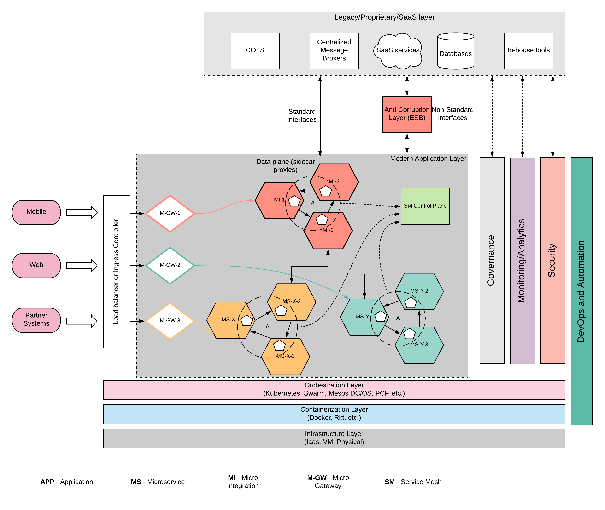
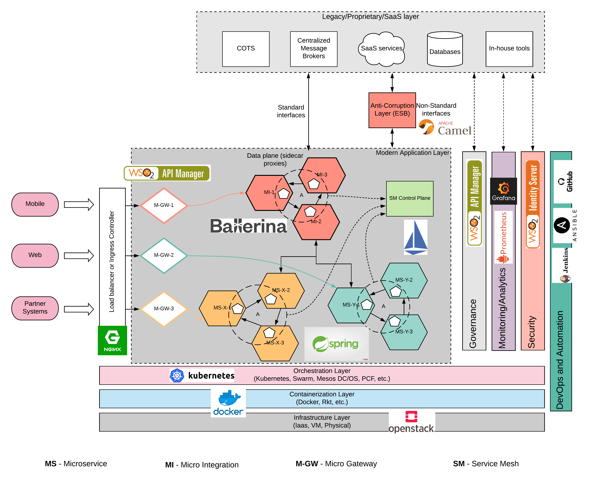

## Introduction

Nearly every enterprise is going through some sort of digital transformation. Early adopters, late boomers, methodical players, every enterprise is trying to modernize their enterprise IT ecosystem to improve their efficiency and become a leader in their respective enterprise domain. If you are an enterprise architect who is responsible for building a digital platform, modernize an existing IT platform or lift and shift an existing deployment into cloud, there are 100s of different software and technology vendors who can support your effort. The days of proprietary software is long gone and people are more and more migrating towards open source software(OSS). One of the major challenges of adopting OSS is the maintenance overhead. But that challenge is absorbed by the mega cloud vendors as well as other cloud services offered by the vendors who created these OSS IP. 

In this post, I’m going to discuss about building a modern digital platform with OSS. Most of the software components I’m using here are free to download and play around. If you really need to build a production grade system, it is recommended to get commercial support from the respective vendors. The other important aspect of this architecture is that it is vendor neutral. You can replace any vendor with OSS or proprietary software without impacting the overall architecture. The components are loosely coupled and can deploy and run independently. 

## Design Principles
The core design principles of this architecture are 

- Loose coupling
- Standard interfaces
- Agile development
- Resiliency
- Open Source Software
- Modularity and replaceability
- Computing efficiency

If you are familiar with the enterprise architecture, the above mentioned design principles are not new for you. Those are concepts we have been discussing day in day out within enterprise architecture panels. The reality check though is that not all these factors were possible to adopt in the past because of the technical limitations. But with the emerging OSS solutions, almost all of these design principles can be adopted with proper architecture and design. 

## Architecture
It is absolutely not possible to finish an enterprise architecture discussion without mentioning the words “microservices”, “containers” and “agility”. Because of that fact and for good reasons, the architecture we are going to design adheres to the microservices standards and will be deployed in containers with agility at its core. 

Figure 01: Modernized Digital Platform Architecture

The above architecture diagram captures multiple dimensions. From left to right, it captures the user interaction flow of the architecture along with functional components (modules) within the architecture. All these components are interacting with each other through standard interfaces and removing one component would not black-out the overall system. From top to bottom, it captures the layers of modules and their relative position in terms of deployment. Let’s try to understand each layer in detail. 

### Legacy/Proprietary/SaaS layer

This is the component layer which is already running in your enterprise. You may have installed Commercial Off The Shelf (COTS) systems, Software as a Service (SaaS) solutions, SQL/No-SQL databases, various Message Brokers as well as some of the in house tools which you have built. The characteristics of these systems are not fully compatible with the design principles which we need to adhere to. But these systems play an integral part within the enterprise IT system which is not easy to replace. Even though some systems like in house tools can be replaced with new services, the rest of the components will stay for a longer period of time. Instead of trying to replace that layer or re architect that, we will make sure that these systems interoperate with our modern architecture in a seamless manner. When building interoperability, we can choose 2 options. 

- Direct connectivity - If these systems exposes standard interfaces like HTTP, the modern application layer can directly connect with this layer
- Anti-Corruption Layer - If the interfaces are non-standard (e.g. SAP, FIX, ISO8583, etc.), an intermediate component like ESB can be used to connect with this layer

This layer can utilize some of the cross functional capabilities like governance, monitoring/analytics and security. 

### Modern Application Layer
#### Core microservices
This is the section of architecture which we build from scratch and will be the layer where most of the modern design principles are applied. The core business services can be implemented as microservices which are capable of 
- Develop/debug/test independently
- Deploy independently
- Scale independently
- Automated deployment through CI/CD
- Running on containers
- Loosely coupled

#### Integration micro services
Once the core business services are implemented as micro services, these services needs to be exposed to consumers through a managed interface. This is where the API Management comes into the picture. The core business services cannot be exposed as it is to the end customer since those business use cases might require information from multiple core micro services. This requires an additional processing at the enterprise back end which can be implemented as a set of separate micro services called “integration micro services”. At the end of the day, these services are similar to microservices but the actual implementations are mainly around common integration requirements like
- Service orchestration
- Data transformation
- Conditional routing
- Data integration
- Cloud integration

#### API Microgateway
Once these core business services and integration micro services are implemented, these services needs to be monitored, governed and secured using centralized, cross functional components. These services can be exposed to consumers through a set of micro gateways so that one set of micro services does not affect the performance or availability of another set of microservices. These micro gateways provides common functionalities which are required by micro services layer. Here are some of the functionalities provided by Micro Gateway.
- Security (Authentication and Authorization)
- Throttling and rate limiting
- Monitoring and analytics
- Caching
- Monetization

#### Service Mesh
When there are 100s of microservices implemented, it becomes a real challenge to manage these microservices. That is where the service mesh comes to the rescue. Service mesh data plane controls the traffic flow between micro services and integration micro services while the control plane controls the overall configuration of the data plane interactions and apply various QOS policies and collect telemetry data. 

### Governance
When building a digital platform with a modern approach like micro services, it is essential to have a proper governing layer due to the amount of different technologies used and the amount of autonomy each time posses. As depicted in the above architecture, there can be 100s of different services implemented by autonomous teams with different SLAs, technologies, message formats, etc. Having a central governance platform to keep all the details about these services will be a key when this platform expands with more and more new services. Some of the features expected of the governance layer are mentioned below.
- Discovery
- Search
- Ratings
- Documentation
- LifeCycle Management (LCM)
- Comments/Reviews/Forums

### Monitoring/Analytics
Monitoring and analytics are 2 separate requirements which are interconnected. Having a proper monitoring on the application layer is essential when adopting a micro services architecture. This is a well accepted fact pointed out by many micro services early adopters. When an issue occurs within a given service, tracking down the issue (debugging) to a particular microservice will become a tedious task if there is no proper monitoring in place. Monitoring the platform is 2 fold.
- Monitoring computing resources - CPU/Memory/Threads/GC
- Monitoring Applications - TPS, Response time, Availability, Usage, Tracing

Sometimes passive monitoring is not sufficient to become a leader in the respective industry or domain. Analyzing the business operations in real time and taking actions is critical in competing with the peers. Analytics capabilities are typically divided into 3 categories.

- Batch analytics - Information is analyzed over a long period of time by running batch jobs on a stored data
- Real time analytics - Analyze information in real-time and taking decisions immediately and sending alerts/notifications
- Machine learning/ Predictive analytics - Proactively analyze and predict events before they occur and plan business operations accordingly (e.g. plan the auto scale groups for seasonal traffic increase)

### Security
Protecting business services is a critical requirement of any digital platform. Data is money. So protecting your data is like protecting your money. There are 2 main functionalities required out of the security layer.

- Authentication - Verify the identity of the user who is trying to access business data
- Authorization - Verify the authority of the user to access a given resource or service

Protecting micro services and micro integration services is enforced at the micro gateway layer where it can interact with a security provider to validate the user requests. OAuth2 and JWT are 2 popular technologies used to protect micro services. 

### DevOps and Automation
Another key aspect of building a modern digital platform is the continous integration and continous deployment or CICD. It plays a pivotal role in building an agile digital platform which is capable of doing multiple releases within a day to compete in the market. It allows enterprises to gain the below mentioned advantages.
- Do frequent releases
- Less human errors
- Improved quality and reduce regression
- Proper governance
- Flexibility

### Load Balancer / Ingress Controller
Exposing the protected services to external world can be done with the usage of a load balancer. Even though this becomes a single point of failure, by having multiple instances of the load balancer users can get rid of that failure. At this layer, additional security measures can be taken to protect malicious users from attacking the system (DOS attacks). 

### Container orchestration layer
Once the services are developed, selecting an infrastructure to run these services plays a major role in the overall system design and architecture. Micro services are destined to be run on a container platform like docker. But running on a container platform does not guarantee the other demands of the consumers. That is where a container orchestration platform comes into the picture. It provides the capabilities mentioned below.

- Self healing
- Auto scaling
- Service discovery
- Overlaying network and DNS
- Ingress controller to accept external traffic
- Automated rollouts and rollbacks

The above mentioned capabilities are key to build the modern application layer with 100s of services running with different workloads and SLAs while utilizing the same set of computing resources. 

### Container runtime
Container runtime is the core piece of software which made all these modern architectures possible. It provided an efficient mechanism to run multiple workloads on a single computing resource without sacrificing resources to run an entire operating system (guest OS). Container runtime platform hides the complexity of resource allocations within a computer similar to the way an operating system handles it but without needing an OS. It also provides the below mentioned advantages.
- Ability to run your software on any platform independently
- Flexibility
- Share across multiple environments
- Stack multiple runtimes into single runtime
- Lightweight 

### Infrastructure 
At the bottom of the stack, it is the actual hardware which is going to run your software. Containers can run on any infrastructure from physical machines to virtual machines to Infrastructure as a Service (IaaS) providers. Depending on the workload, users can select the type of infrastructure which needs to be used. 

The above architecture is an open architecture which can be implemented with many different technologies for the same component. Let’s see how this architecture can be built using a 100% open source software stack. 

## Reference architecture with OSS
The below architecture diagram depicts the open source software which can be used for each and every component. 

Figure 02: Modern enterprise digital platform with OSS

Let’s see how each open source technology is selected for relevant components within the architecture.

- Infrastructure layer - OpenStack is an open source IaaS software which you can use to build a virtualization layer on top of your on premise data center resources. 
- Container runtime - Docker is the most adopted container runtime used in the industry for enterprise deployments. 
Container orchestration - Kubernetes is becoming the de-facto standard for container orchestration. Most of the IaaS providers offer managed docker services which will offload the entire management aspect of the kubernetes deployment. 
- Microservices implementation - Spring Boot is the most popular open source framework written in Java for microservices development. There are many other open source frameworks for other languages like Go, .Net, etc.
- Service Mesh framework - Istio is becoming the industry adopted service mesh technology not because of the backing by tech giants but also due to the performance and stability. 
- Integration micro services - Ballerina is becoming the language of choice when it comes to writing integrations in a microservices style of architecture. 
- Governance - WSO2 API Manager is an open source API management platform which provides design time governance for your microservices architecture. 
- Monitoring/Analytics - Prometheus is an open source monitoring framework which is capable of monitoring complex architectures like MSA. Grafana is an open source platform for beautiful analytics and monitoring. 
- Security - WSO2 Identity Server is an open source identity and access management platform capable of providing authentication and authorization capabilities to the architecture. 
- Micro gateway - WSO2 API Microgateway is an open source gateway built for supporting microservices architectures where users needs to run gateways for a selected set of APIs and with private jet mode. 
- Load balancer/Ingress controller - Nginx is one of the leading software load balancers which has an implementation of ingress controller for kubernetes based deployments.
- Anti-Corruption Layer - Apache camel is one of the most popular ESB solutions which is widely accepted. 
- DevOps and Automation - Github can be used as the source repository which maintains the source code which is developed. Jenkins can be configured to automate the build, test, deployment process which will do frequent releases without any human interaction. Ansible is used to manage the infrastructure and automate the server deployment. 

